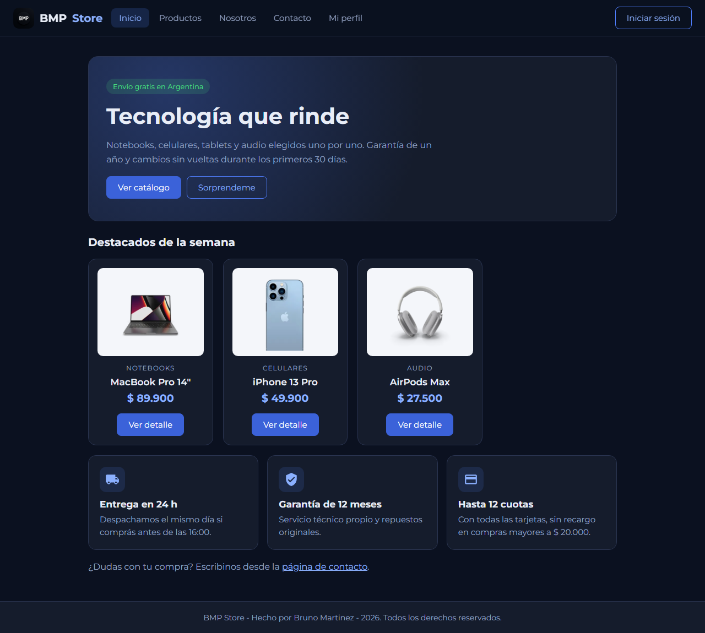
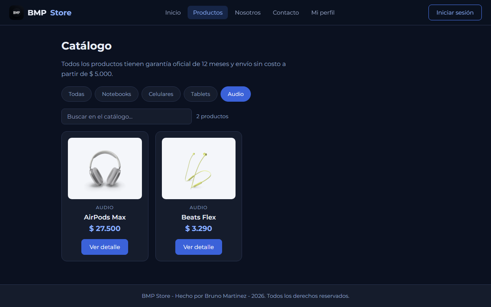
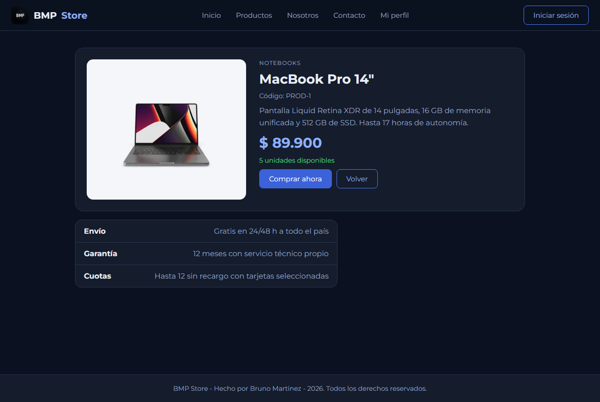
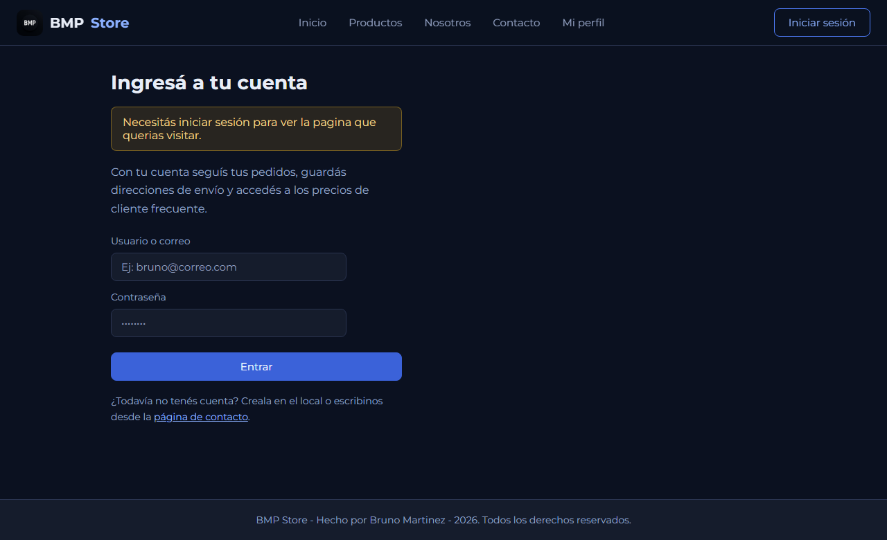
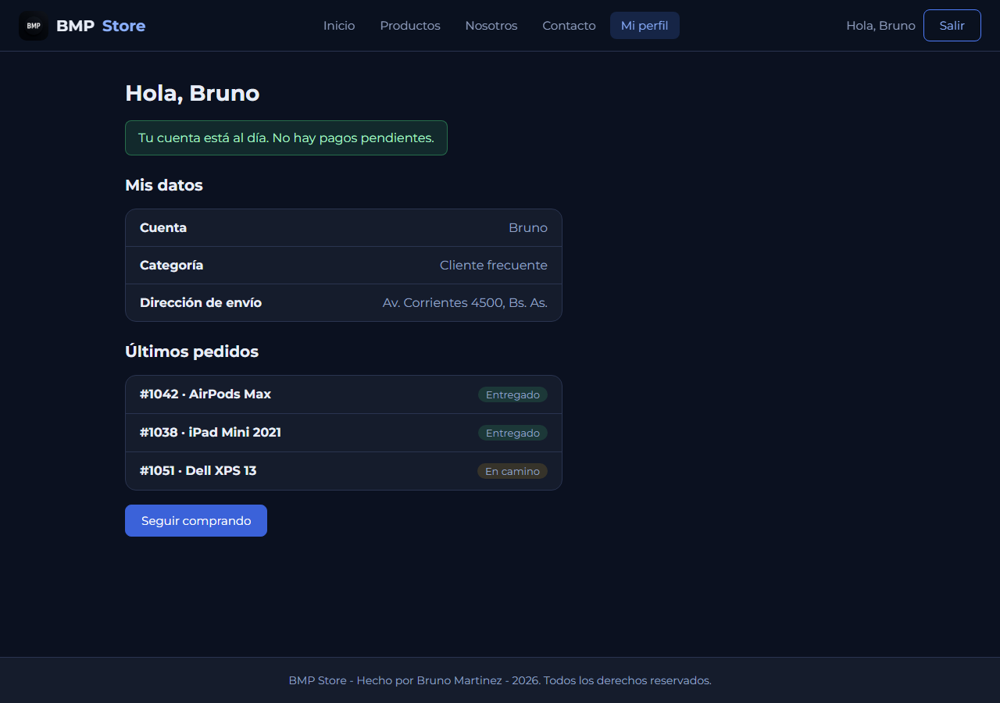
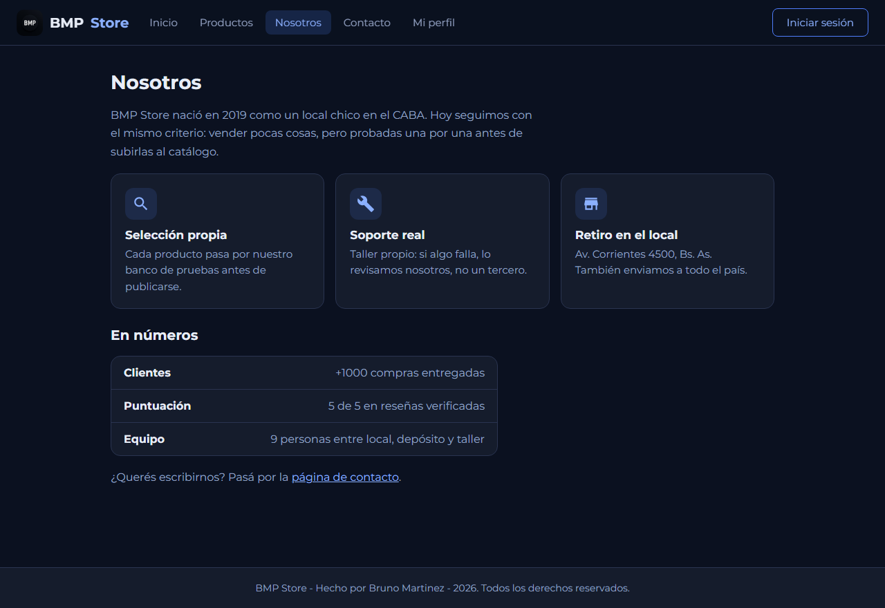
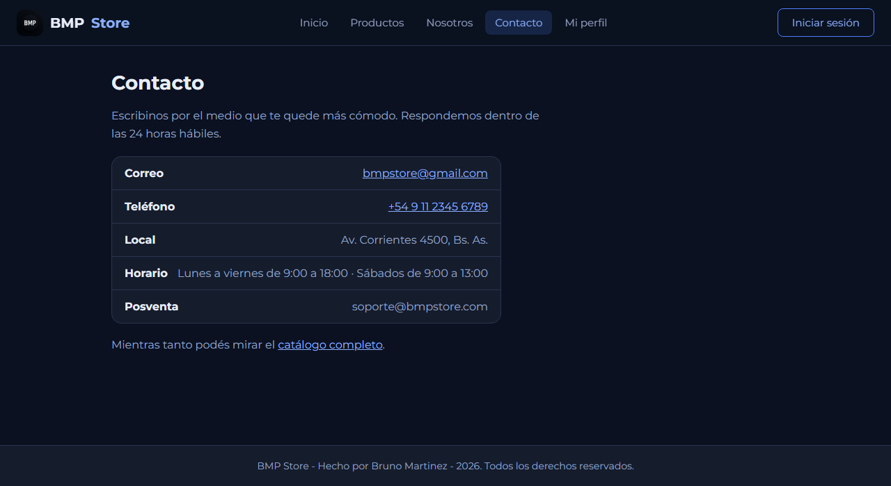
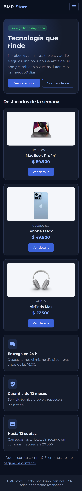
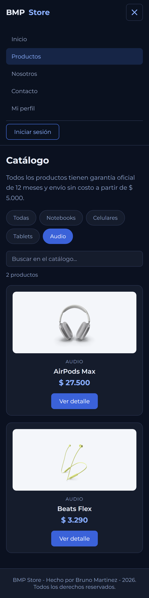
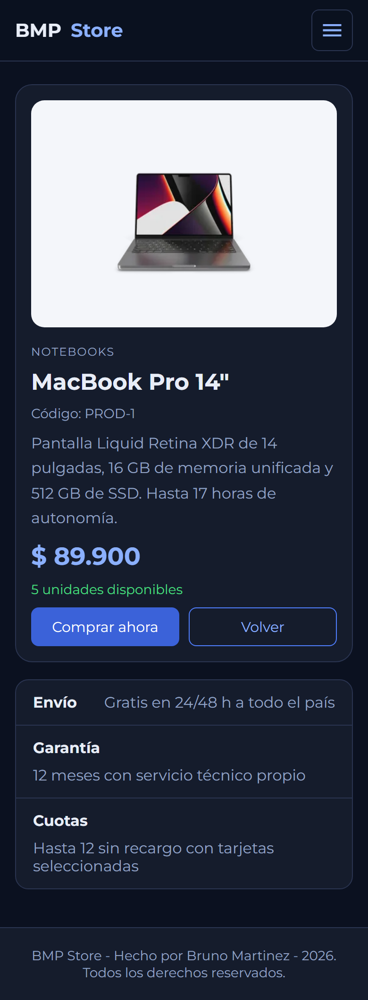

# BMP Store — Enrutamiento en React con React Router

Tienda de tecnología hecha con **React** y **Vite**, con **React Router** para el
enrutamiento del lado del cliente. La app tiene páginas estáticas, un catálogo con
filtros guardados en la URL, una ficha de producto dinámica y una sección de
cuenta protegida por login.

Toda la app está envuelta con `BrowserRouter` y las rutas se declaran con `Routes`
y `Route` dentro de un layout con navegación fija.

## Funcionalidades

- Enrutamiento configurado con `BrowserRouter`, `Routes` y `Route`.
- Páginas estáticas: **Inicio**, **Nosotros** y **Contacto**.
- Navegación declarativa con `Link` y `NavLink` (el enlace de la sección actual
  queda marcado como activo).
- Navegación imperativa con `useNavigate` (botones *Ver catálogo*, *Sorprendeme*,
  *Comprar ahora* y *Volver*).
- Ficha de producto en la ruta dinámica `/producto/:id`: el parámetro se lee con
  `useParams` y se muestra como código de producto.
- Filtros del catálogo guardados en la URL con `useSearchParams`
  (`/productos?categoria=audio&buscar=beats`), así el enlace se puede compartir.
- Rutas anidadas con `<Outlet />` dentro de un layout de navegación fija.
- Sección de cuenta protegida con `Navigate` y `useLocation`: sin sesión redirige
  al login, avisa por qué, y al entrar vuelve a la página que se había pedido.
- Página 404 con `path="*"` para las URLs que no existen.
- Tema oscuro propio con variables CSS, tipografía Montserrat e íconos SVG.

## Capturas de pantalla

### Inicio



### Catálogo con query params (`/productos?categoria=audio`)



### Ficha de producto en ruta dinámica (`/producto/1`)



### Ruta protegida sin sesión (`/perfil` redirige al login)



### Ruta protegida con la sesión iniciada



### Nosotros y Contacto





### Vista móvil (390 px)

| Inicio | Menú desplegable | Ficha de producto |
|--------|------------------|-------------------|
|  |  |  |

---

## Diseño responsive

El layout se adapta con **CSS puro** (sin librerías) y un único punto de corte en
**720 px**:

| Zona | En escritorio | En móvil |
|------|---------------|----------|
| Barra de navegación | Logo + enlaces + sesión en una fila | Botón hamburguesa que abre y cierra un panel vertical; el logo queda solo con el texto |
| Grilla de productos | `repeat(auto-fill, minmax(220px, 1fr))`: 4 columnas | La misma regla resuelve 1 columna sola, sin media query |
| Ficha del producto | `grid` de 2 columnas (foto + datos) | 1 columna, foto más chica |
| Botones y buscador | Ancho según contenido | Ocupan todo el ancho para tocarlos con el pulgar |

El menú móvil es lo único que necesita JavaScript: un `useState` en `Layout.jsx`
guarda si está abierto, y cada `NavLink` lo cierra al navegar.

---

## Rutas de la aplicación

| Ruta | Página | Qué muestra |
|------|--------|-------------|
| `/` | `Inicio.jsx` | Portada con destacados y navegación imperativa. |
| `/productos` | `Productos.jsx` | Catálogo con filtros por categoría y búsqueda en la URL. |
| `/producto/:id` | `Producto.jsx` | Ficha del producto según el `id` de la URL. |
| `/nosotros` | `Nosotros.jsx` | Página estática con información de la tienda. |
| `/contacto` | `Contacto.jsx` | Página estática con los datos de contacto. |
| `/login` | `Login.jsx` | Ingreso a la cuenta con redirección post-login. |
| `/perfil` | `Perfil.jsx` | Sección privada, protegida por `RutaProtegida`. |
| `*` | `NoEncontrada.jsx` | Página 404 para cualquier URL inexistente. |

---

## Hooks y componentes de React Router utilizados

| Hook / componente | Dónde se usa | Para qué |
|-------------------|--------------|----------|
| `BrowserRouter` | `main.jsx` | Envuelve toda la app para habilitar el enrutamiento. |
| `Routes` y `Route` | `App.jsx` | Declaran qué página se muestra en cada URL. |
| `Link` | `Layout.jsx`, páginas | Navegación declarativa entre páginas. |
| `NavLink` | `Layout.jsx` | Igual que `Link`, pero marca el enlace activo. |
| `Outlet` | `Layout.jsx` | Lugar donde se dibujan las rutas anidadas. |
| `useNavigate` | `Inicio.jsx`, `Producto.jsx`, `Login.jsx` | Navegación imperativa desde el código. |
| `useParams` | `Producto.jsx` | Lee el parámetro `:id` de la URL. |
| `useSearchParams` | `Productos.jsx` | Lee y escribe los query params de los filtros. |
| `useLocation` | `RutaProtegida.jsx`, `Login.jsx`, `NoEncontrada.jsx` | Sabe en qué ruta está el usuario y de dónde viene. |
| `Navigate` | `RutaProtegida.jsx` | Redirige al login cuando no hay sesión. |

---

## Cómo funciona la ruta protegida

Si entrás a `/perfil` sin sesión, `RutaProtegida` te manda al login con `Navigate`
y guarda de dónde venías en el `state`. El login lee ese dato con `useLocation`,
avisa por qué te redirigió y, cuando entrás, `useNavigate` te devuelve a la página
que querías ver.

La sesión se guarda en un `useState` de `App.jsx`: no hay backend ni validación de
contraseña, es solo una simulación.

---

## Estructura del proyecto

```text
tarea_3m2/
├── media/                              # Capturas de pantalla para el README
├── public/
│   ├── img/                            # Fotos de los productos
│   ├── favicon.png
│   └── logo.png
├── src/
│   ├── components/
│   │   ├── Icono/
│   │   │   ├── Icono.jsx               # Íconos SVG de Material Symbols
│   │   │   └── Icono.css
│   │   ├── Layout/
│   │   │   ├── Layout.jsx              # Navegación fija + <Outlet />
│   │   │   └── Layout.css
│   │   ├── ProductoCard/
│   │   │   ├── ProductoCard.jsx        # Tarjeta de producto reutilizable
│   │   │   └── ProductoCard.css
│   │   └── RutaProtegida/
│   │       └── RutaProtegida.jsx       # Redirige al login si no hay sesión
│   ├── data/
│   │   └── productos.js                # Catálogo y helpers de categoría/precio
│   ├── pages/
│   │   ├── Inicio.jsx                  # Portada + useNavigate
│   │   ├── Nosotros.jsx                # Página estática
│   │   ├── Contacto.jsx                # Página estática
│   │   ├── Productos.jsx               # Catálogo + useSearchParams
│   │   ├── Producto.jsx                # Ruta dinámica + useParams
│   │   ├── Login.jsx                   # Ingreso + redirección post-login
│   │   ├── Perfil.jsx                  # Sección privada
│   │   ├── NoEncontrada.jsx            # Página 404
│   │   └── index.js                    # Exporta todas las páginas juntas
│   ├── shared/
│   │   └── shared.css                  # Estilos compartidos por las páginas
│   ├── App.jsx                         # Configuración de las rutas
│   ├── index.css                       # Estilos globales y paleta del tema
│   └── main.jsx                        # Punto de entrada con BrowserRouter
├── .gitignore
├── .oxlintrc.json
├── index.html
├── vite.config.js
└── package.json
```

---

## Cómo ejecutar el proyecto

### 1. Clonar el repositorio

```bash
git clone https://github.com/Bruno395dev/tarea_3m2.git
cd tarea_3m2
```

### 2. Instalar dependencias

```bash
npm install
```

### 3. Levantar el servidor de desarrollo

```bash
npm run dev
```

Abrir en el navegador la URL que muestra la consola (por defecto
`http://localhost:5173`).

### Otros comandos

```bash
npm run build     # Genera la versión de producción en la carpeta dist/
npm run preview   # Sirve la versión de producción para probarla
npm run lint      # Revisa el código con oxlint
```

---

## Tecnologías utilizadas

- React 19
- React Router 7
- Vite
- CSS con variables (tema oscuro)
- Tipografía Montserrat (Google Fonts)

---

## Créditos del autor

| Campo      | Detalle                                  |
|------------|------------------------------------------|
| **Nombre** | Bruno Martinez                           |
| **Curso**  | 181751                                   |
| **Módulo** | 2 — Unidad 3                             |
| **Tema**   | Enrutamiento en React con React Router   |

---

## Bibliografía y fuentes consultadas

- Documentación oficial de React: <https://es.react.dev/>
- Documentación oficial de React Router: <https://reactrouter.com/>
- Rutas con `Routes` y `Route`: <https://reactrouter.com/start/declarative/routing>
- Navegación con `Link` y `useNavigate`: <https://reactrouter.com/start/declarative/navigating>
- Hooks de React Router (`useParams`, `useSearchParams`, `useLocation`): <https://reactrouter.com/api/hooks/useParams>
- Documentación oficial de Vite: <https://vite.dev/>
- Variables CSS (MDN): <https://developer.mozilla.org/es/docs/Web/CSS/Using_CSS_custom_properties>

## Créditos de recursos

- Logo BMP: diseño propio.
- Fotos de los productos: DummyJSON (<https://dummyjson.com/>). Las descargué a
  `public/img/` para no depender de un servidor externo.
- Íconos: Material Symbols de Google (<https://fonts.google.com/icons>).
- Tipografía: Montserrat, de Google Fonts.
- Las marcas y modelos del catálogo se usan solo como ejemplo.

---
